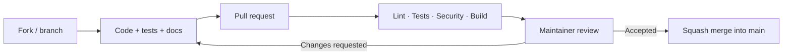

# PipeForge

A small, extensible CI/CD framework: describe a pipeline once and run it locally or on a CI runner.

**Status: working pre-alpha (`0.1.0.dev0`).** The shell runner, CLI, configuration resolver, tests, and CI workflow are implemented. Install from this checkout; no release has been published. The configuration format may change before 1.0.

## Quick start

Requires Python 3.11+ and Linux or macOS with `/bin/sh`. Windows shell execution is not supported yet.

```sh
python3 -m venv .venv
source .venv/bin/activate
python -m pip install --upgrade pip
python -m pip install -e .

pipeforge validate -f examples/hello-world/pipeforge.yml
pipeforge run -f examples/hello-world/pipeforge.yml
```

Or create `pipeforge.yml` in your project:

```yaml
name: hello
pipeline:
  - name: Hello
    script: python -c "print('Hello PipeForge')"
```

```sh
pipeforge validate
pipeforge run --dry-run
pipeforge run
```

PipeForge validates the configuration, resolves values and environment secrets, runs steps sequentially, and stops on failure. Each step runs in a separate `/bin/sh` process, with its working directory set to the configuration file's directory. Known declared secrets are masked in output.

Output is buffered until a step finishes (maximum 8 MiB per step). The default timeout is 300 seconds. Commands run with your user permissions and inherited environment: only execute trusted pipelines. See the [configuration reference](docs/configuration.md) for syntax, limits, and exit codes.

Docker, Terraform, Kubernetes, remote Git modules, and package publishing come later.

## Contributing

Everyone can fork the repository and propose changes. Keep each pull request focused; the maintainer reviews and merges it.



The [CI workflow](.github/workflows/ci.yml) defines **Lint**, **Tests**, **Security**, and **Build**. Tests cover Linux Python 3.11–3.13 and macOS Python 3.12. Required-check enforcement is a separate GitHub setting to enable after the first successful server run.

- [Contribution guide](CONTRIBUTING.md)
- [Architecture, testing, review, and roadmap — українською](docs/development-plan.md)
- [Security policy](SECURITY.md)

Licensed under [Apache-2.0](LICENSE).
