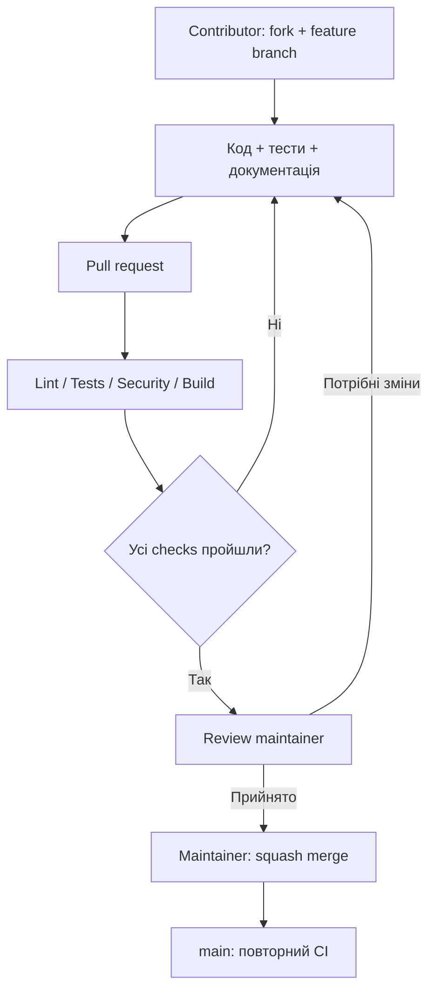

# PipeForge: простий план розробки

Мета — невеликий Python framework, у якому pipeline можна перевірити й запустити локально, а потім використати в CI. Починаємо з робочого ядра, тести й документацію додаємо разом із кодом.

Гасло: **Define once. Run anywhere. Debug locally.**

Початкове ядро вже реалізоване: Python package, CLI та bootstrap launcher `./run`, jobs/steps/run, DAG і вибір jobs, shell executor, values/secrets/Git resolver, streaming-маскування, кольоровий summary, JSON/Markdown reports, unit/integration tests і CI workflow. Поточний MVP — `0.1.0`; автоматична публікація описана в [releasing.md](releasing.md). Точний реалізований формат описано в [configuration.md](configuration.md), команди перевірки — у [CONTRIBUTING.md](../CONTRIBUTING.md). Налаштування GitHub, описані нижче, потрібно перевірити й застосувати окремо після першого успішного серверного CI.

## 1. Мінімальна архітектура

```text
CLI → Config loader → Resolver → Engine → Executor
                                  ↓          ↓
                             Logger + masking
```

| Частина | Відповідальність |
| --- | --- |
| CLI | `validate`, `run`, `run --dry-run`; зрозумілі помилки й exit codes |
| Config | Безпечне читання YAML, перевірка структури, відхилення невідомих полів |
| Resolver | Значення `${values.*}` і секрети `${secrets.*}` з environment |
| Engine | Послідовний запуск кроків; зупинка після першої помилки |
| Executor | Запуск команд, робоча директорія, timeout, завершення процесів |
| Logger | Назва кроку, час, результат, очищення від відомих секретів |

Поточна структура:

```text
src/pipeforge/
  __init__.py
  cli.py
  errors.py
  config.py
  resolver.py
  engine.py
  executor.py
  logging.py
tests/
  unit/
  integration/
examples/pipelines/basic/pipeforge.yml
.github/workflows/review.yml
pyproject.toml
```

Не створюємо порожні каталоги для кожного майбутнього модуля. Виділяємо підпакети, коли код справді потребує цього.

«Один pipeline для різних CI» означає однаковий формат і поведінку PipeForge за однакових залежностей. Python, shell, Docker та інші зовнішні інструменти забезпечує користувач або runner. ОС і встановлені інструменти можуть впливати на результат.

## 2. Перший робочий контракт

- Python 3.11+; executor працює на Linux/macOS. CI містить Linux matrix та macOS job; Windows поки не підтримується.
- Файл за замовчуванням — `pipeforge.yml`; `name` та непорожня mapping `jobs` обов’язкові; старий `pipeline` поки сумісний.
- Job має `steps` і необов’язкові `needs`; крок має `run` і необов’язковий `name`. Граф виконується послідовно в топологічному порядку.
- `validate` перевіряє структуру й посилання без запуску команд. Обов’язкові секрети перевіряються перед `run`; dry-run не друкує їхніх значень.
- Успіх повертає `0`; помилка конфігурації та збій виконання повертають документовані ненульові коди.
- `${git.sha}`, `${git.short_sha}`, `${git.branch}`, `${git.tag}` уже підтримуються через values/env. Environment overlays, plugin discovery і Git modules — наступні етапи.
- Кольори вмикаються для інтерактивного термінала; звичайний текст придатний для CI.

Секрети оголошуються через environment, без реальних значень у YAML. Не завантажуємо `.env` автоматично. Values і secrets підставляються лише в step `env`; у script читаємо звичайні shell variables або `os.environ`. PipeForge не додає секрети до shell-тексту, але автор script відповідає за те, як його команди використовують environment.

## 3. Автоматичні перевірки

Один `review.yml`, чотири стабільні назви checks. Перевірки запускаються паралельно на PR та push у `dev`/`main`; кожне оновлення PR запускає їх знову.

| Check | Що виконує |
| --- | --- |
| Lint | `ruff check`, `ruff format --check`, `mypy` для пакета |
| Tests | `pytest`: unit + integration на Linux, Python 3.11–3.13; macOS, Python 3.12 |
| Security | Bandit для власного коду та `pip-audit` для встановлених залежностей |
| Build | Побудова wheel/sdist, перевірка metadata, встановлення wheel у чисте середовище та CLI smoke test |

Matrix jobs включають назву ОС і Python version. Реалізований фінальний job **Tests** з `if: always()` перевіряє, що всі matrix jobs успішні; failure, cancellation або skip не дають зелений результат. Саме його назву додаємо до ruleset.

Не ставимо фільтри шляхів на required workflow: навіть PR лише з документацією має отримати необхідні checks. Dependency scan, який не зміг виконатись, не вважаємо успішним. Версії інструментів перевірки фіксуємо, а GitHub Actions pin-имо на commit SHA та оновлюємо через Dependabot.

Спочатку запускаємо CI успішно на реальному коді, потім додаємо чотири check names у ruleset. Не додаємо заглушки, які завжди проходять. PR із CI має зафіксувати однакові локальні й серверні команди.

## 4. Що саме тестувати

| Рівень | Приклади |
| --- | --- |
| Unit | Невалідний YAML, невідомі поля, відсутнє значення, циклічне посилання, відсутній required secret |
| Unit | Маскування повторюваних, перекривних і багаторядкових секретів; безпечні помилки resolver |
| Integration | Запуск CLI як subprocess із тимчасової директорії, реальний hello-world pipeline |
| Integration | Помилка другого кроку зупиняє третій; timeout; stderr; ненульовий exit code |
| Integration | Dry-run нічого не виконує; секрет не потрапляє у stdout, stderr або повідомлення помилки |
| Package | Wheel встановлюється без checkout проєкту; entry point працює; приклад запускається |

Тести не потребують AWS, Docker daemon, production credentials або мережі. Для майбутніх інтеграцій unit-тести використовують mocks, а справжні зовнішні тести запускаються окремо в контрольованому середовищі. Coverage спершу допомагає знаходити прогалини; довільний відсоток не замінює перевірку помилок.

## 5. Contributors та review



Будь-хто може створити fork і PR. Право прямого запису в upstream для цього не потрібне. На старті залишаємо write/admin доступ лише maintainer-у. CODEOWNERS спрямовує review до `@CloudOpsMaster`, але сам по собі не блокує merge.

Maintainer перевіряє: чи вирішено проблему, чи зрозумілий API, чи протестовані збої, чи немає витоку секретів, чи відповідає документація реалізації. Зміни workflow та залежностей теж потребують уважного review. Зелені checks не доводять безпечність довільного коду.

За `approvals = 0` GitHub не вимагає людського approval. Це стартовий режим для одного maintainer-а: contributors пропонують зміни, а merge робиш ти. Не можна вимагати одного approval від самого себе для власного PR.

Коли з’явиться другий maintainer: додати його до CODEOWNERS, увімкнути 1 required approval, code-owner review та скидання approval після нових commits. Тоді власні PR теж переглядає інша людина. CODEOWNERS — маршрут і вимога review, а права доступу визначають, хто може натиснути merge.

## 6. Налаштування GitHub

Цей документ не змінює Settings автоматично.

| Налаштування | Початкове значення |
| --- | --- |
| Ruleset | Active, default branch; без звичайних bypass actors |
| Захист | Restrict deletions, Block force pushes, Require PR |
| Merge | Тільки squash; automatically delete head branches |
| Review | 0 approvals, поки maintainer один; resolve conversations |
| Required checks | Lint, Tests, Security, Build — після першого успішного CI |
| Up-to-date branch | Увімкнути разом із required checks |
| Actions | Дозволені; read-only token; заборонити Actions створювати/схвалювати PR |
| Fork PR | GitHub-hosted runner; схвалення запусків зовнішніх contributors |
| Security | Dependabot alerts, security updates, secret scanning та push protection — якщо доступні |
| Releases | Версія + changelog у PR; після зеленого main CI — автоматичний tag/release |

PR workflow використовує `pull_request`, `permissions: contents: read`, `persist-credentials: false` при checkout і timeout для jobs. Не запускаємо неперевірений код PR через `pull_request_target`, з production secrets або на self-hosted runner. Дозвіл запустити CI для fork PR — окрема дія від схвалення коду до merge.

Dependabot version updates для pip додаємо разом із `pyproject.toml`, для GitHub Actions — разом із workflow. Достатньо щотижневих оновлень та невеликого ліміту відкритих PR.

About: `Reusable CI/CD framework for local and CI pipeline execution.` Topics спочатку: `cicd`, `devops`, `python`, `automation`, `github-actions`. Інші topics додаємо, коли відповідні інтеграції з’являться.

Деталі поведінки GitHub: [CODEOWNERS](https://docs.github.com/en/repositories/managing-your-repositorys-settings-and-features/customizing-your-repository/about-code-owners), [Actions permissions та forks](https://docs.github.com/en/repositories/managing-your-repositorys-settings-and-features/enabling-features-for-your-repository/managing-github-actions-settings-for-a-repository).

## 7. Порядок реалізації

1. **Реалізовано — package + CLI + CI:** `pyproject.toml`, `src/pipeforge`, CLI help, тести, чотири реальні checks, Dependabot. Серверний запуск CI й увімкнення required checks залишаються наступними діями після публікації змін.
2. **Реалізовано — config + executor:** validate, послідовні shell steps, timeout, exit codes, hello-world, обмеження output і прибирання process group.
3. **Реалізовано — resolver + logs:** values, env secrets, маскування, dry-run, кольори для термінала; regression tests перевіряють помилки й витоки секретів. Логи streaming-яться через redactor; кольорова консоль має summary, `-v`, `-vv`. Звіти й логи — у `.pipeforge/runs/`, `latest` веде на останній завершений run.
4. **Прототип v0.1.0:** актуальна документація, чисте встановлення, ручна перевірка, changelog; лише потім tag/release за рішенням maintainer-а.
5. **Розширення:** спочатку один корисний модуль, наприклад Docker, і мінімальний контракт модуля. Git modules з перевіреним immutable commit, інші CI adapters, environment overlays і діагностика — окремі наступні задачі.

Релізи не прив’язані до кожного merge. Release job публікує перевірені артефакти того самого main CI run, коли версія у pyproject.toml змінилась. PyPI publishing додаємо пізніше через Trusted Publishing та захищене environment. `v1.0.0` — після стабілізації публічного API й конфігураційного формату; навіть до 1.0 несумісні зміни описуємо в changelog.

## Наступні етапи після jobs + launcher

1. Container executor: однаковий image локально й у CI; зараз працює host execution, тому однакове середовище ще не гарантується.
2. Мінімальний `uses` plugin API та один Docker module.
3. Terraform/Kubernetes/Helm modules й environment overlays.
4. Remote modules з immutable commit verification; `doctor`.
5. ForgeAI після стабілізації report schema: rules → пояснення → пропозиції; далі classifier/optional LLM. Без автоматичних руйнівних команд і декоративних confidence.

Робочі гілки: `feature/*` → `dev` → перевірений `main`; релізи — tags `v*`, без `prod` branch. Нові можливості не рекламуємо як підтримувані, доки немає реалізації та тестів.
